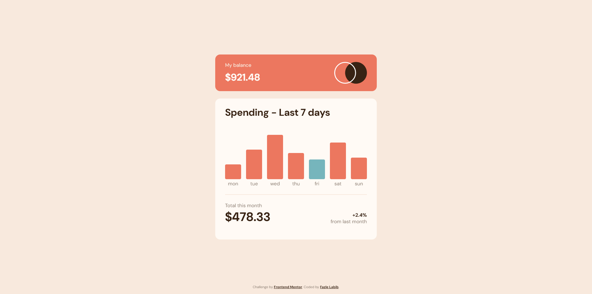
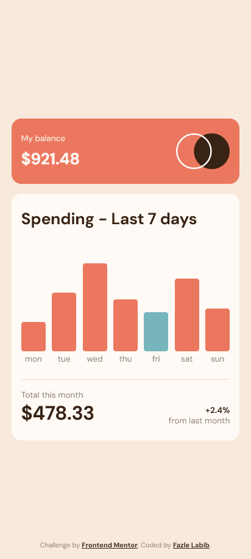

# Frontend Mentor - Expenses chart component solution

This is a solution to the [Expenses chart component challenge on Frontend Mentor](https://www.frontendmentor.io/challenges/expenses-chart-component-e7yJBUdjwt). Frontend Mentor challenges help you improve your coding skills by building realistic projects. 

## Table of contents

- [Overview](#overview)
  - [The challenge](#the-challenge)
  - [Screenshot](#screenshot)
  - [Links](#links)
- [My process](#my-process)
  - [Built with](#built-with)
  - [What I learned](#what-i-learned)
  - [Useful resources](#useful-resources)
- [Author](#author)

## Overview

### The challenge

Users should be able to:

- View the bar chart and hover over the individual bars to see the correct amounts for each day
- See the current day’s bar highlighted in a different colour to the other bars
- View the optimal layout for the content depending on their device’s screen size
- See hover states for all interactive elements on the page
- **Bonus**: Use the JSON data file provided to dynamically size the bars on the chart

### Screenshot




### Links

- Solution URL: [https://github.com/FazleLabib/frontend-mentor-expenses-chart-component](https://github.com/FazleLabib/frontend-mentor-expenses-chart-component)
- Live Site URL: [https://fazlelabib.github.io/frontend-mentor-expenses-chart-component](https://fazlelabib.github.io/frontend-mentor-expenses-chart-component)

## My process

### Built with

- Semantic HTML5 markup
- CSS custom properties
- Flexbox
- Mobile-first workflow
- Vanilla JavaScript

### What I learned

Honed my JavaScript skills more with this one. Applied some css techniques such as adding two classes to make the "show amount on hover" work.

<!-- ```html
<h1>Some HTML code I'm proud of</h1>
``` -->
<!-- ```css
.proud-of-this-css {
  color: papayawhip;
}
```
```js
const proudOfThisFunc = () => {
  console.log('🎉')
}
``` -->

### Useful resources

- [Handling start day of the week](https://stackoverflow.com/questions/24480062/get-start-and-end-of-week-with-the-start-on-monday-and-end-on-sunday-in-javascri) - This helped me to make a monday the start of the week.

## Author

- Frontend Mentor - [@FazleLabib](https://www.frontendmentor.io/profile/FazleLabib)